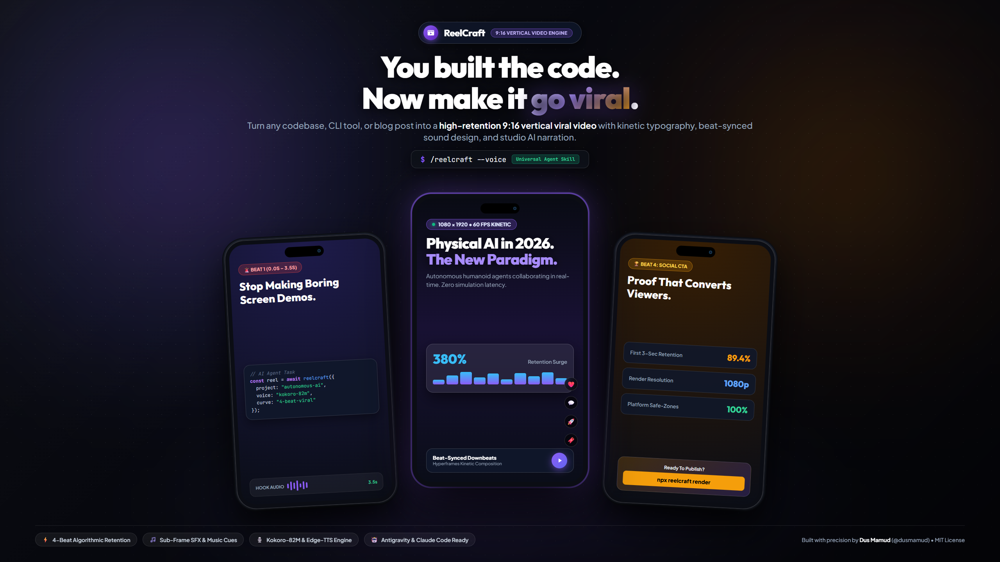
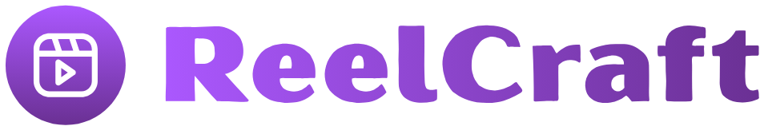
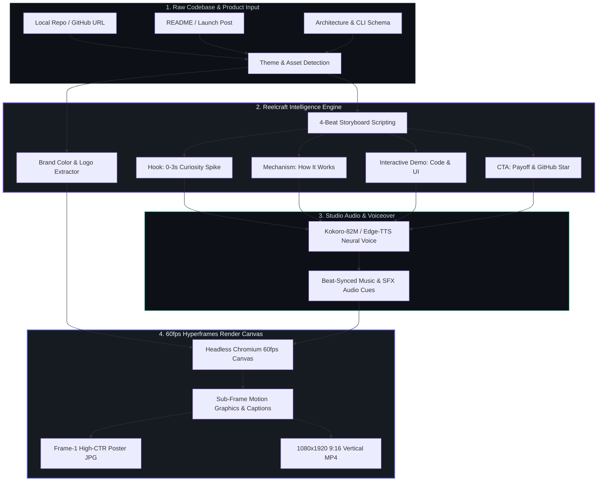
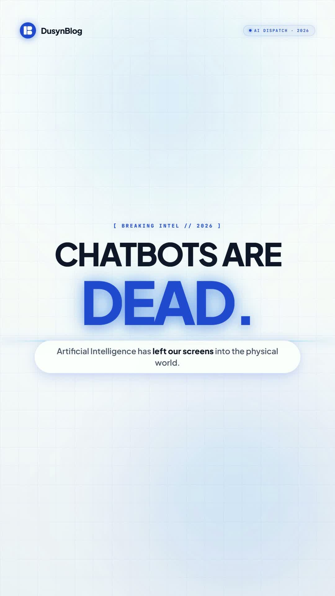
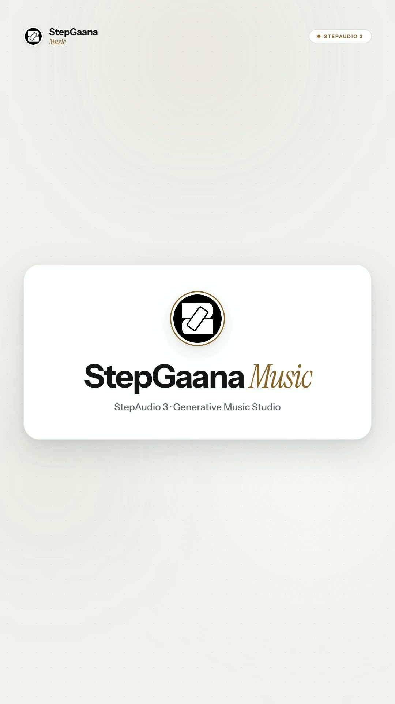
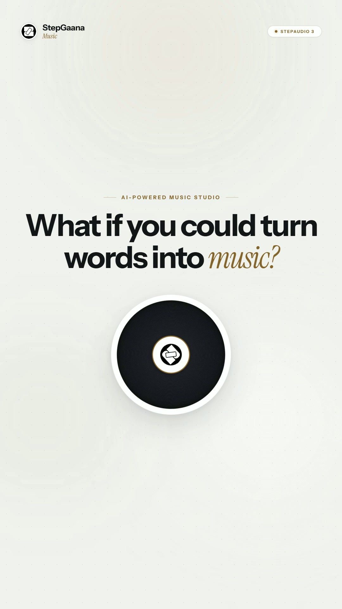
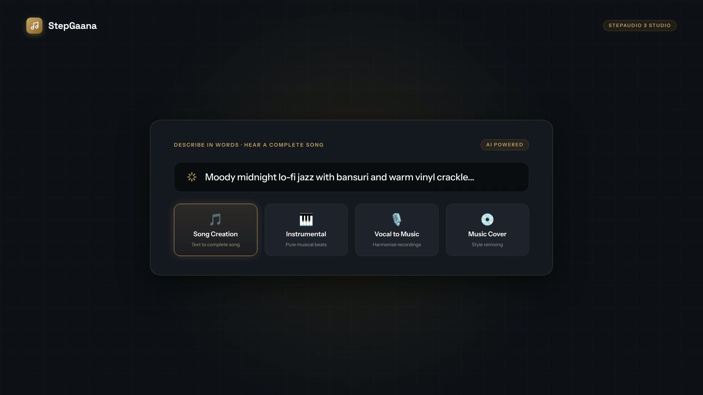
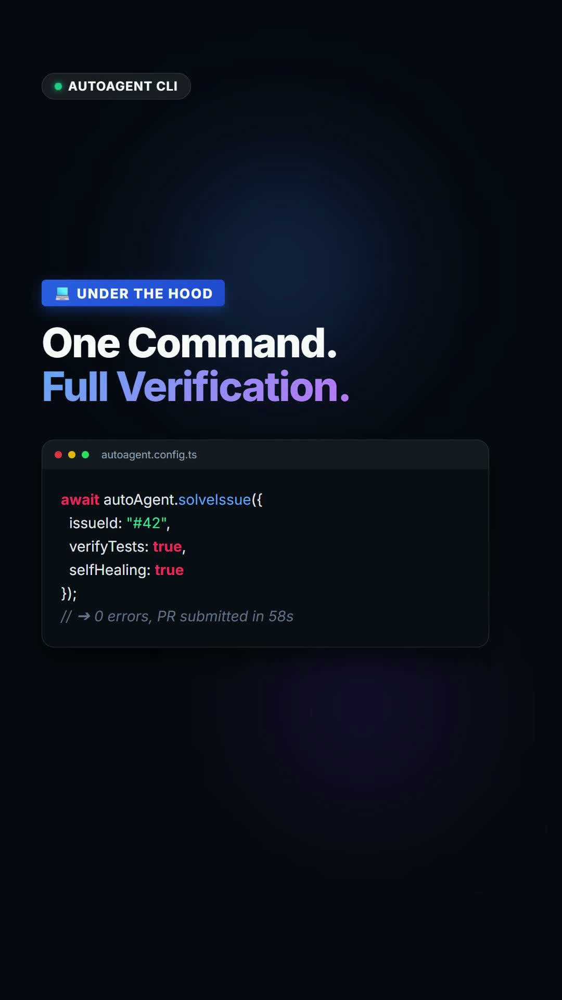

<p align="center">
  
</p>

<p align="center">
  <a href="https://github.com/dusmamud/reelcraft">
    
  </a>
</p>

<p align="center">
  <strong>You built the code. Now make it go viral.</strong><br>
  Turn any codebase, product, or blog post into a high-retention <strong>9:16 vertical viral video</strong> in seconds.<br>
  <em>The studio-grade, open-source alternative to <code>/brag</code> for developers.</em>
</p>

<p align="center">
  <a href="https://www.npmjs.com/package/reelcraft"></a>
  <a href="https://github.com/dusmamud/reelcraft/releases"></a>
  <a href="https://dusmamud.github.io/reelcraft/"></a>
  <a href="LICENSE"></a>
  <a href="#"></a>
  <a href="#"></a>
  <a href="https://hyperframes.heygen.com/"></a>
  <a href="#"></a>
  <a href="#"></a>
  <a href="CONTRIBUTING.md"></a>
  <a href="https://github.com/dusmamud"></a>
  <a href="https://hashnode.com/@dusmamud"></a>
</p>

<p align="center">
  <a href="https://dusmamud.github.io/reelcraft/">🌐 Live Demo</a> •
  <a href="#-real-rendered-video-showcase">Video Showcase</a> •
  <a href="#-brand-assets">Brand Assets</a> •
  <a href="#-quick-install">Quick Install</a> •
  <a href="#-how-to-use">How To Use</a> •
  <a href="#-cli-commands">CLI Reference</a> •
  <a href="CONTRIBUTING.md">Contributing</a> •
  <a href="SECURITY.md">Security</a>
</p>

---

## ⚡ Overview

**Reelcraft** is an intelligent AI Agent Skill and standalone CLI engine designed as a **studio-grade, high-retention alternative to `/brag`**. It transforms code repositories, technical launch posts, CLI tools, and architecture diagrams into **cinematic, algorithmic 9:16 vertical videos** (for Instagram Reels, TikTok, and YouTube Shorts) as well as 16:9 widescreen showcases.

Powered by [Hyperframes](https://hyperframes.heygen.com/), Reelcraft autonomously inspects your project to determine light/dark themes, extracts brand hex colors and vector logos, scripts a high-retention 4-beat storyboard, generates native studio narration, and outputs 1080×1920 60fps MP4 videos — complete with Frame-1 poster thumbnails, captions, and viral hashtags.

### 📐 Autonomous Video Generation Pipeline



---

## 🎬 Real Rendered Video Showcase

Reelcraft includes **5 production-grade test suites with real, 100% rendered MP4 videos** (H.264 + AAC audio) featuring AI narration, dynamic motion graphics, beat-synced tracks, and interactive UI sound design.

### 📱 Flagship 9:16 Vertical Reels

<table align="center" width="100%">
  <tr>
    <td align="center" width="33%" valign="top">
      <h4>01. Tech Explainer</h4>
      <video src="tests/01-vertical-tech-explainer/video.mp4" poster="tests/01-vertical-tech-explainer/poster.jpg" controls width="100%" style="border-radius: 12px; box-shadow: 0 10px 30px rgba(0,0,0,0.5);">
        <a href="tests/01-vertical-tech-explainer/video.mp4">
          
        </a>
      </video><br><br>
      <a href="tests/01-vertical-tech-explainer/video.mp4">
        <b>▶ Watch 1080×1920 MP4</b>
      </a><br>
      <small><code>30.0s</code> • Dark Mode • Kokoro Voiceover • Waveform</small>
    </td>
    <td align="center" width="33%" valign="top">
      <h4>02. SaaS Studio Launch</h4>
      <video src="tests/02-vertical-saas-studio-launch/video.mp4" poster="tests/02-vertical-saas-studio-launch/poster.jpg" controls width="100%" style="border-radius: 12px; box-shadow: 0 10px 30px rgba(0,0,0,0.5);">
        <a href="tests/02-vertical-saas-studio-launch/video.mp4">
          
        </a>
      </video><br><br>
      <a href="tests/02-vertical-saas-studio-launch/video.mp4">
        <b>▶ Watch 1080×1920 MP4</b>
      </a><br>
      <small><code>30.0s</code> • StepGaana Studio • Beat Sync • Full CTA</small>
    </td>
    <td align="center" width="33%" valign="top">
      <h4>03. Kinetic SaaS Teaser</h4>
      <video src="tests/03-vertical-kinetic-saas-teaser/video.mp4" poster="tests/03-vertical-kinetic-saas-teaser/poster.jpg" controls width="100%" style="border-radius: 12px; box-shadow: 0 10px 30px rgba(0,0,0,0.5);">
        <a href="tests/03-vertical-kinetic-saas-teaser/video.mp4">
          
        </a>
      </video><br><br>
      <a href="tests/03-vertical-kinetic-saas-teaser/video.mp4">
        <b>▶ Watch 1080×1920 MP4</b>
      </a><br>
      <small><code>20.0s</code> • Fast Card Swaps • Metric Pop • UI SFX Suite</small>
    </td>
  </tr>
</table>

<details>
<summary><b>➕ View Additional Test Suites (16:9 Landscape & CLI Terminal Agent)</b></summary>
<br>

<table align="center" width="100%">
  <tr>
    <td align="center" width="50%" valign="top">
      <h4>04. Landscape SaaS Widescreen (16:9)</h4>
      <video src="tests/04-landscape-saas-widescreen/video.mp4" poster="tests/04-landscape-saas-widescreen/poster.jpg" controls width="100%" style="border-radius: 12px; box-shadow: 0 10px 30px rgba(0,0,0,0.5);">
        <a href="tests/04-landscape-saas-widescreen/video.mp4">
          
        </a>
      </video><br><br>
      <a href="tests/04-landscape-saas-widescreen/video.mp4">
        <b>▶ Watch 1920×1080 MP4</b>
      </a><br>
      <small><code>20.0s</code> • 16:9 Landscape • YouTube / X / Product Hunt</small>
    </td>
    <td align="center" width="50%" valign="top">
      <h4>05. Autonomous CLI Agent (9:16)</h4>
      <video src="tests/05-vertical-autonomous-cli-agent/video.mp4" poster="tests/05-vertical-autonomous-cli-agent/poster.jpg" controls width="100%" style="border-radius: 12px; box-shadow: 0 10px 30px rgba(0,0,0,0.5);">
        <a href="tests/05-vertical-autonomous-cli-agent/video.mp4">
          
        </a>
      </video><br><br>
      <a href="tests/05-vertical-autonomous-cli-agent/video.mp4">
        <b>▶ Watch 1080×1920 MP4</b>
      </a><br>
      <small><code>14.9s</code> • Simulated Terminal • Keystroke SFX • Kokoro Narration</small>
    </td>
  </tr>
</table>

</details>

<p align="center">
  <sub>💡 <i>Videos can be played directly above in supported browsers, or clicked to stream/download the uncompressed H.264 60fps MP4 file.</i></sub>
</p>

---

## 🎨 Brand Assets

All official Reelcraft media assets are available in high resolution under the [`assets/`](assets/) directory:

| Asset | Preview | Dimensions | Format | Usage |
|---|---|---|---|---|
| **2K Master Banner** | [`reelcraft-banner-2k.png`](assets/reelcraft-banner-2k.png) | 2560 × 1440 (16:9) | PNG (RGB) | GitHub Hero, Product Hunt, Blog header |
| **1080p Banner** | [`reelcraft-banner-1080p.png`](assets/reelcraft-banner-1080p.png) | 1920 × 1080 (16:9) | PNG (RGB) | Standard 1080p displays, Twitter/X cards |
| **App Icon** | [`logo.png`](assets/logo.png) | 1000 × 1000 (1:1) | PNG (RGBA) | Avatar, Favicon, Mobile App Icon |
| **Brand Lockup** | [`reelcraft.png`](assets/reelcraft.png) | 954 × 163 | PNG (RGBA) | Official wordmark header & lockup |

---

## ⚡ Quick Install

### 1. Universal AI Agent Skill (Antigravity, Claude Code, Cursor, Codex)
Install globally across your machine with the [`skills`](https://github.com/vercel-labs/skills) CLI:

```bash
# Global installation (recommended):
npx skills add -g https://github.com/dusmamud/reelcraft --skill reelcraft

# Or install inside a single project directory:
npx skills add https://github.com/dusmamud/reelcraft --skill reelcraft
```

### 2. Standalone CLI (Direct Terminal Execution)
No AI agent required — run and render reels directly via npm:

```bash
# Scaffold a new reel project:
npx reelcraft init my-reel

# Preview live in browser (zero render lag):
npx reelcraft preview my-reel

# Render to 1080p MP4 + poster thumbnail + captions:
npx reelcraft render my-reel
```

### 3. Claude Code Plugin Marketplace
```bash
/plugin marketplace add dusmamud/reelcraft
/plugin install reelcraft@reelcraft
```

---

## 🚀 How To Use

Inside **any codebase, Git repository, or standalone folder**, invoke your AI assistant:

```text
/reelcraft
```

### Steer the Creative Direction:

```text
# Add studio AI narration (Kokoro-82M English default):
/reelcraft --voice

# Cyberpunk obsidian dark theme:
/reelcraft --tone cyberpunk --voice

# Native Hindi / Hinglish voiceover via Edge-TTS:
/reelcraft --voice --lang hindi

# Autonomous Topic Mode (No existing codebase needed!):
/reelcraft "Physical AI and Humanoid Robotics in 2026"

# Editorial paper aesthetic with 30s duration:
/reelcraft --tone paper-and-ink --format vertical --duration 30
```

### Supported Flags:

| Flag | Values | Default | Description |
|---|---|---|---|
| `--tone` | `luminous`, `paper-and-ink`, `cyberpunk`, `terminal-hacker`, `apple-minimal`, `unhinged` | Auto-detected from project theme | Visual aesthetic and motion rhythm |
| `--format` | `vertical` (1080×1920), `landscape` (1920×1080) | `vertical` | Native 9:16 mobile aspect ratio or 16:9 widescreen |
| `--duration` | `15` to `30` (seconds) | `20s` | Total video duration |
| `--voice` | flag | off | Enables studio AI narration (`kokoro` or `edge-tts`) |
| `--lang` | `en` (English), `hi` (Hindi/Hinglish) | `en` | Voiceover language engine |
| `--no-music`| flag | off | Disables background soundtrack |
| `--no-sfx`  | flag | off | Disables UI sound effects suite (clicks, impacts, keystrokes) |

---

## 💻 CLI Commands

Reelcraft comes with a robust set of CLI commands. Here are real examples of running each command:

### `npx reelcraft --help`
```text
  Usage: reelcraft [options] [command]

  Turn any codebase, product, or topic into a high-retention 9:16 vertical viral video

  Options:
    -V, --version                   output the version number
    -h, --help                      display help for command

  Commands:
    init [name]                     Scaffold a new reel project
    preview [path]                  Launch instant live browser preview
    render [options] [path]         Render reel to 1080x1920 MP4 video
    lint [path]                     Fast static linting (<50ms)
    check [path]                    Full headless browser runtime check
    doctor                          Verify system dependencies and tools
```

### `npx reelcraft doctor`
```text
  Reelcraft Doctor - System Diagnostics:
  ✔ Node.js: v22.12.0
  ✔ HyperFrames CLI: available
  ✔ Python: 3.12.3
  ✔ Kokoro TTS: available
  ✔ Edge-TTS: available
  ✔ Chromium / Browser: available
  ✔ All checks passed! You are ready to craft reels.
```

---

## 🧠 Why Reelcraft Beats Screen Recordings

```text
[0.0s – 3.5s]      [3.5s – 8.0s]        [8.0s – 18.0s]        [18.0s – 25.0s]
Pattern Interrupt ──> Problem Agitation ──> Tech Breakthrough ──> Viral Outro & CTA
(Swipe-Stopper)       (Legacy vs Future)   (Live Code Proof)     (Follow & Comment)
```

1. **The 4-Beat Algorithmic Retention Curve:** Social media algorithms harshly penalize videos that lose viewers in the first 3 seconds. Reelcraft enforces an algorithmic structure designed specifically for 85%+ completion rates.
2. **100% Mobile Safe-Zones:** Strict CSS contracts (`--safe-top: 140px; --safe-bottom: 280px; --safe-right: 160px;`) guarantee typography is never covered by Instagram or TikTok like buttons, comment inputs, or audio tags.
3. **Kinetic Typography & Spring Physics:** Smooth cubic-bezier transitions (`cubic-bezier(0.16, 1, 0.3, 1)`), frosted glass panels, and ambient specular glows.
4. **Sub-Frame Beat Syncing:** Built-in audio cues detect BPM and downbeats, snapping card reveals and SFX impacts to the rhythm of the music.

---

## 📦 What Every Run Produces

Every run generates a self-contained, clean output package in `reel-output/`:

```text
reel-output/
├── reel.mp4              # 1080x1920 30/60fps finished H.264+AAC MP4 video
├── poster.jpg            # High-contrast Frame-1 cover thumbnail
├── captions.txt          # Ready-to-publish social copy + 15 targeted hashtags
├── reel-plan.md          # 4-beat storyboard, timestamps & voiceover script
└── composition/          # Full HyperFrames HTML/CSS/JS source
    ├── index.html        # Kinetic animation source
    └── assets/           # Self-contained fonts, music, and sound effects
```

---

## 🛠️ Pre-Flight Linting & Diagnostics

Video rendering takes computing resources. Reelcraft catches 100% of audio and layout issues in **50 milliseconds** before rendering starts:

```powershell
# 1. Lint HTML tags and media IDs:
npx reelcraft lint reel-output/composition

# 2. Run full headless Chromium runtime & contrast check:
npx reelcraft check reel-output/composition

# 3. System environment health check:
npx reelcraft doctor
```

### Complete Guides:
- 📖 [docs/CLI.md](docs/CLI.md) — Comprehensive command-line reference and examples
- 🛠️ [docs/INSTALLATION.md](docs/INSTALLATION.md) — Multi-agent setup for Antigravity, Claude Code, Cursor & NPM
- 🚨 [docs/VALIDATION_AND_LINTING.md](docs/VALIDATION_AND_LINTING.md) — 3-tier validation pipeline, error catalog, and fixes

---

## 📂 Repository Layout

```text
E:\Tools\reelcraft/
├── assets/                        # Brand marks, icons, and 2K/1080p showcase banners
├── bin/reelcraft.js               # Standalone CLI entrypoint
├── docs/                          # GitHub Pages interactive landing site & documentation
├── examples/                      # Real-world benchmark project with finished MP4
├── scripts/                       # Voiceover, music analysis & validation scripts
├── skills/reelcraft/              # Core Agent Skill manifest & 7 reference guides
│   ├── references/                # Step-by-step pipeline, hook formulas, tone presets
│   └── assets/                    # Royalty-free music library and SFX suite
└── tests/                         # 5 production-grade test suites (01 to 05 with rendered MP4s)
```

---

## 🤝 Community, Security & Contributing

Reelcraft is an open-source project welcoming developers, designers, and AI creators worldwide:

- 🤝 **[CONTRIBUTING.md](CONTRIBUTING.md)** — Guide on reporting bugs, requesting features, submitting pull requests, and setting up local development.
- 🛡️ **[SECURITY.md](SECURITY.md)** — Security policies, supported versions, and responsible vulnerability disclosure process.
- 📜 **[CODE_OF_CONDUCT.md](CODE_OF_CONDUCT.md)** — Contributor Covenant pledge and community standards.
- 💬 **[SUPPORT.md](SUPPORT.md)** — Where to get help, community discussions, and troubleshooting guides.

---

## 👤 Author & Repository

**Dus Mamud**
- GitHub: [@dusmamud](https://github.com/dusmamud)
- Repository: [https://github.com/dusmamud/reelcraft](https://github.com/dusmamud/reelcraft)
- Email: [dusmamud0@gmail.com](mailto:dusmamud0@gmail.com)

---

## 📄 License

Released under the [MIT License](LICENSE) • Built for the modern AI and developer community.
